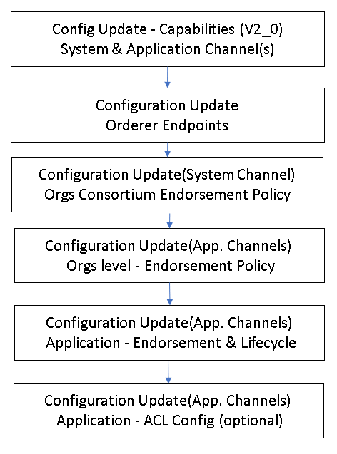

[//]: # (##############################################################################################)
[//]: # (Copyright Mohit Vaish. All Rights Reserved.)
[//]: # (SPDX-License-Identifier: Apache-2.0)
[//]: # (##############################################################################################)

# Upgrading Hyperledger Fabric version from 1.4.x to 2.2.x

- [Pre-requisites](#pre_req)
- [Steps to upgrade](#upgrade_steps)

## Pre-requisites
A DLT system which is using Hyperledger Fabric version 1.4.x and is setup using Bevel.

The operator should have access to all the kubernetes clusters and vaults. It is an assumption that operator has one network.yaml file which consists of all participating organizations such as peers and orderers.

All participants organization for each channel should be admins for the respective channel.

## Steps to upgrade
The following steps occur when the operator runs the upgrade process:

1. Upgrade of orderer binaries in a rolling fashion to the Fabric version mentioned in network yaml file.
2. Upgrade of peer binaries in a rolling fashion to the Fabric version mentioned in network yaml file.
3. Update channel configuration of system channel and any application channels. The following areas are updated:
	1.	Orderer address endpoints
	2.	Endorsement policies for system channel consortium
	3.  Endorsement policies for application channel orgs 
	4.	Endorsement and lifecycle policies of application group for application channels 
	5.	Optional Step: Update the ACLs for application channels (The operator has to specify the acls json and mention the file path with in network.yaml at location network->channels-channel-acls). 	Please refer sample ACL json format [here](https://hyperledger-fabric.readthedocs.io/en/release-2.2/enable_cc_lifecycle.html). Only "acls" section of the json is required for this step.

The operator doing this upgrade should have access to all kubernetes cluster(s) to verify the logs of any pods as prompted by the upgrade process workflow.

---

**NOTE**: Once this upgrade process is started, it would not be possible to revert back the hyperledger fabric network to previous version.

---

The following are the steps to be  performed:
## 1. Update network.yaml for upgrade
Update the network network.yaml [here](https://github.com/hyperledger/bevel/tree/main/platforms/hyperledger-fabric/configuration/samples/network-fabricv2.yaml)
 
	a. Set the required version tag under `network.version` for upgrading the base images of CA, orderer and peer.
	b. Add the upgrade flag to true
	For example:
		network:
	  		version: 2.2.2
			upgrade: true	

Note: The network.yaml should reflect the entire network which requires to be upgraded

## 2. Executing Ansible playbook
To start the upgrade process, execute run.sh script. It runs the playbook [site.yaml](https://github.com/hyperledger/bevel/tree/main/platforms/shared/configuration/site.yaml) that uses the network.yaml configuration file mentioned in earlier step ([network.yaml](https://github.com/hyperledger/bevel/tree/main/platforms/hyperledger-fabric/configuration/samples/network-fabricv2.yaml) for Hyperledge Fabric).

Once the orderer, peer, CA and cli binaries are upgraded, the channel configuration updates are done which is shown in the image below:

As upgrade workflow executes the operator is asked to validate the upgraded nodes and then proceed for next steps.

## 4. Compare core.yaml & orderer.yaml
Where core.yaml and orderer.yaml is modified in the existing(to be upgraded) network, a backup of these files needs to be taken before starting the upgrade process. After succesful upgrade a diff is required with core.yaml and orderer.yaml of the upgraded network. Based on this analysis the upgraded system files shall be modified. Please refer details [here](https://hyperledger-fabric.readthedocs.io/en/release-2.2/upgrading_your_components.html#overview)

## 5. Upgrade existing Chaincode lifecycle
Any existing chaincode should be verified as it should continue running as usual. It will be good practice to update them new Hyperledger Fabric 2.2.x lifecycle.

The v2.x ccenv image that is used to build Go chaincodes no longer automatically vendors the Go chaincode shim dependency like the v1.4 ccenv image did. The recommended approach is to vendor the shim in your v1.4 Go chaincode before making upgrades to the peers and channels, since this approach works with both a v1.4.x and v2.x peer. Please refer this [link](https://hyperledger-fabric.readthedocs.io/en/release-2.2/upgrade_to_newest_version.html#chaincode-shim-changes) for details
